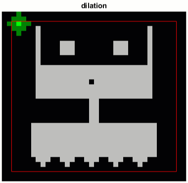

# Binary Morphology in Image Processing

 or 

**Curriculum Module**

_Created with R2024a. Compatible with R2024a and later releases._

# Information

This curriculum module contains interactive [MATLAB® live scripts](https://www.mathworks.com/products/matlab/live-editor.html) that illustrate and apply the fundamentals of morphological operations used for processing binary images.

## Background

You can use these live scripts as demonstrations in lectures, class activities, or interactive assignments outside class. This module covers the primary morphological operations of erosion and dilation, opening and closing, as well as relational and logical operators by illustrating and applying their use to simple images. It also includes examples of using binary morphology to analyze images of coins.

The instructions inside the live scripts will guide you through the exercises and activities. Get started with each live script by running it one section at a time. To stop running the script or a section midway (for example, when an animation is in progress), use the  Stop button in the **RUN** section of the **Live Editor** tab in the MATLAB Toolstrip.

## Contact Us

Solutions are available upon instructor request. Contact the [MathWorks teaching resources team](mailto:onlineteaching@mathworks.com) if you would like to request solutions, provide feedback, or if you have a question.

## Prerequisites

This module assumes knowledge of MATLAB at the level of the [MATLAB Onramp](https://matlabacademy.mathworks.com/details/matlab-onramp/gettingstarted), a free two\-hour introductory tutorial to learn the essentials of MATLAB. This module also assumes some familiarity with set theory and logical notation. 

## Getting Started
### Accessing the Module
### **On MATLAB Online:**

Use the  link to download the module. You will be prompted to log in or create a MathWorks account. The project will be loaded, and you will see an app with several navigation options to get you started.

### **On Desktop:**

Download or clone this repository. Open MATLAB, navigate to the folder containing these scripts and double\-click on [Morphology.prj](https://matlab.mathworks.com/open/github/v1?repo=MathWorks-Teaching-Resources/Morphology-in-Image-Processing&project=Morphology.prj&file=README.mlx). It will add the appropriate files to your MATLAB path and open an app that asks you where you would like to start. 

Ensure you have all the required products (listed below) installed. If you need to include a product, add it using the Add\-On Explorer. To install an add\-on, go to the **Home** tab and select   **Add-Ons** > **Get Add-Ons**. 

## Products

MATLAB® and the Image Processing Toolbox™ are used throughout. 

# Scripts
## [**BinaryMorphologyBasics.mlx**](https://matlab.mathworks.com/open/github/v1?repo=MathWorks-Teaching-Resources/Morphology-in-Image-Processing&project=Morphology.prj&file=Scripts/BinaryMorphologyBasics.mlx) 
|      |      |
| :-- | :-- |
|  | **In this script, students will...**     |
|     | $\bullet$ define and apply the primary morphological operations: erosion and dilation   $\bullet$ explain the use of relational and logical operators in the context of binary image processing   $\bullet$ define and apply compound morphological operations like opening and closing   $\bullet$ explain the effect of using structuring elements of different shapes and sizes for each morphological operation   $\bullet$ identify and apply the appropriate morphological operations and structuring elements to achieve a given processing outcome   $\bullet$ use simple shapes to filter objects in an image     |
|      |       |

[**PracticeProblems.mlx**](https://matlab.mathworks.com/open/github/v1?repo=MathWorks-Teaching-Resources/Morphology-in-Image-Processing&project=Morphology.prj&file=Scripts/PracticeProblems.mlx) 

# Related Courses
## [Image Processing Onramp](https://matlabacademy.mathworks.com/details/image-processing-onramp/imageprocessing)

Learn the basics of practical image processing techniques in MATLAB. Modify and extract information from images to develop an algorithm.

Or feel free to explore our other [modular courseware content](https://www.mathworks.com/matlabcentral/fileexchange/?q=tag%3A%22courseware+module%22&sort=downloads_desc_30d).

# Educator Resources
-  [Educator Page](https://www.mathworks.com/academia/educators.html) 

# Contribute 

Looking for more? Find an issue? Have a suggestion? Please contact the [MathWorks teaching resources team](mailto:%20onlineteaching@mathworks.com). If you want to contribute directly to this project, you can find information about how to do so in the [CONTRIBUTING.md](https://github.com/MathWorks-Teaching-Resources/Morphology-in-Image-Processing/blob/release/CONTRIBUTING.md) page on GitHub.

 *©* Copyright 2021 The MathWorks™, Inc

